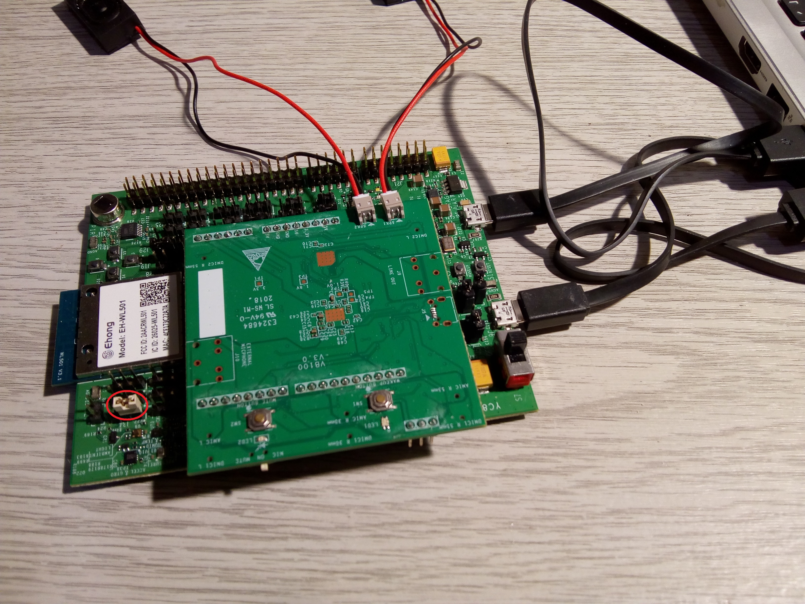
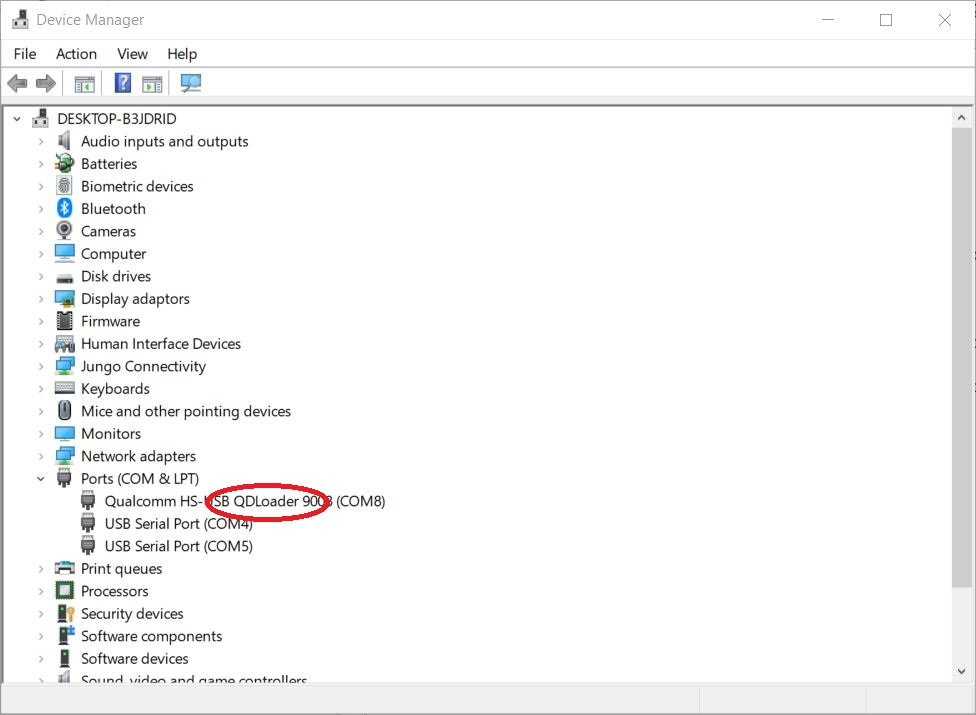

# Qualcomm Home Hub Alexa Demo
This repo contains tested pre-compiled firmware for the Home Hub 100 AIS demo

## Installation
Tested on Windows 10

1. Install [Python 2.7](https://www.python.org)

1. Download and install the QCA4020 SDK (QCA4020.OR.3.3 OEM QCA SDK+CDB) from [Qualcomm](https://www.qualcomm.com/products/qca4020/software)

1. In a Command Prompt clone the repo

	```
	git clone https://github.com/milnepe/qualcomm-home-hub-alexa.git
	```

1. Change to the project directory

	```
	cd qualcomm-home-hub-alexa
	```

1. Copy the ais directory and contents to the SDK directory:

	```
	xcopy ais c:\qca4020-or-3-3_qca_oem_sdk-cdb\target\quartz\ais\ /s
	```

1. On the main board, connect a jumper to Pin1 & Pin2 on J34. This puts the chip in Emergency Download (EDL) mode.

	

1. Connect J6 & J85 to host with micro-USB cables and switch ON. The Qualcomm device driver should install and show up as QDLoader in Windows Device Manager.

	If Device Manager shows errors, update the driver and use Windows Update to install an optional driver from Qualcomm

	

1. Change to the following SDK directory:

	```
	cd C:\qca4020-or-3-3_qca_oem_sdk-cdb\target\quartz\demo\ais\build\gcc
	```

1. Run the flash script, replacing the comm port setting for your QDLoader device - this will flash Quartz_HASHED.elf onto the device:

	```
	python ..\..\..\..\..\build\tools\flash\qflash.py --comm 8 --debug
	```

1. When the process has completed switch OFF and remove J34 jumper.

The demo firmware has now been installed.
